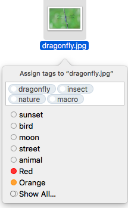
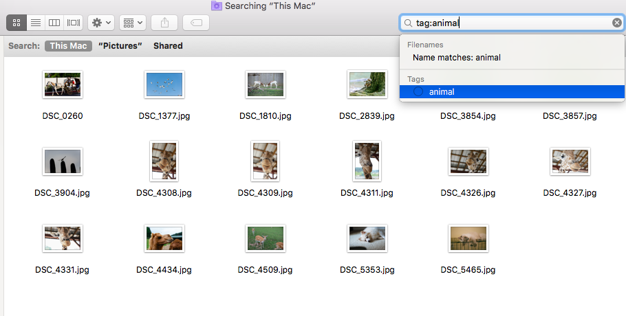

# image-tagger
**image-tagger** is a tool that analyzes your local image files, generates tags(keywords), and automatically adds those tags to your image files, so that you can search your images by tags on your computer. You don't need to upload your files to Web hosting services, it all happens on your local hard disks or even your external hard drives.

***Currently only support MacOS***


## Preview
This program will add tags to you image file:



Then you can search tags use Finder or Spotlight




## Getting Started

First you need to get a free api key from [here](http://www.alchemyapi.com/api/register.html)

Simply fill out the forms then you will receive a free api key.

Clone the repository

```
# Get the latest snapshot
git clone https://github.com/jefferyhe/imageTagger.git

# Change directory
cd src

# Apply api key
python alchemyapi.py your-api-key
(replace your-api-key to the one your received from your email)

# Time to rock n' roll
python main.py dragonfly.jpg
or python main.py /user/jeffery/Pictures

# The parameter could be a path of image file or a directory containing image files
```


